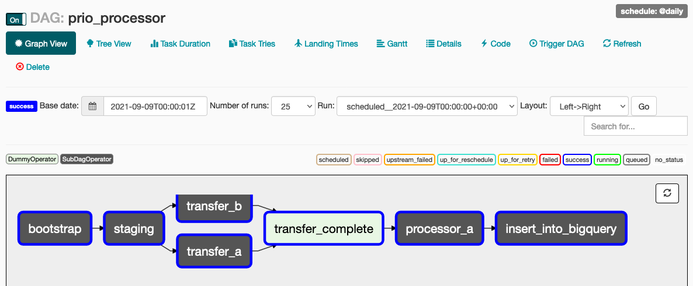

# Running prio-processor on Airflow

A prio-processor job is implemented in
[mozilla/telemetry-airflow](https://github.com/mozilla/telemetry-airflow/), the
repository that powers many of the scheduled queries and jobs within the data
organization within Mozilla. This section describes how the DAG (directed
acyclic graph of tasks) is orgnized within the repository, and the Google Cloud
Platform services that it utilizes.

## DAG overview

The `prio-processor` DAG is split up between work that is done by an `admin`
entity and an server `a` entity.

The `admin` project handles the following jobs:

- `bootstrap` - copy the built python egg and entrypoint scripts into a cloud
  storage bucket for use in Dataproc (hosted Spark). Check `bin/dataproc` for
  more details.
- `staging` - Read data from BigQuery and write out batch-id partitioned ndjson
  files into a bucket owned by the `admin` project.
- `transfer_*` - Copy data from the `admin` project into the storage buckets of
  server a and server b

Server a then runs the `processor_a` job. This is run on an emphemeral
Kubernetes cluster [using the
`GKEPodOperator`](https://airflow.apache.org/docs/apache-airflow/1.10.15/_api/airflow/contrib/operators/gcp_container_operator/index.html).
The pod operator will fetch the relevant container image, and the configure the
job using environment variables that include secrets inside of the Airflow
cluster.

Finally, the `admin` project will read data from server a's private bucket where
the final aggregate results are stored. This is written into a BigQuery table
that lives within the admin project.

## Infrastructure overview

The infrastructure is managed in the [mozilla-services/cloudops-infra][cloudops]
repository. It is split into two domains: prod and nonprod. The prod projects
are used to run code inside of workflow.telemetry.mozilla.org, and contains the
secret keys for Origin Telemetry aggregates that are running on Prio v1. The
nonprod projects are used in the local development workflow for running jobs
using inside of the telemetry-airflow repository.

In each realm, the projects are broken up as follows:

- `admin` - This contains resources that are designed to interop with the rest
  of the Mozilla data platform. Service accounts in this project have the
  ability to read from the BigQuery datasets in `moz-fx-data-shared-prod`.
  Having access to the main BigQuery project is necessary to preprocess the raw
  data into a format that is acceptable for `prio-processor` containers. This
  project utilizes Dataproc for preprocessing data, and also run various scripts
  using the `prio-processor` image on an ephemeral GKE cluster.
- `server-a` - This project contains resources necessary to run a container on
  GCP. In particular, service accounts provisioned for Airflow have the ability
  to create and delete GKE clusters. These clusters are spun up on-demand, which
  allows data engineers to change the node pool specifications quickly. There
  are various cloud storage buckets that are configured to support multi-party
  communication.
- `server-b` - A copy of server-a, but designed to be dropped for use with an
  external partner.

## Development

As of 2021-09-20, there are 6 projects involved with the processing of Firefox nightly data.

- moz-fx-prio-admin-prod-098j
- moz-fx-prio-admin-nonprod-8uy7
- moz-fx-prio-a-prod-kju7
- moz-fx-prio-a-nonprod-bf65
- moz-fx-prio-b-prod-a67n
- moz-fx-prio-b-nonprod-h77y

The `prod` variant is used to run the job in the production telemetry-airflow
environment. The `nonprod` projects are used in development, which is the
docker-compose workflow that runs on a local host. In addition to the general
README instructions on the telemetry-airflow repository, run the following
script [located in this gist][update-creds]. For this, you will need to have
access to each individual project and the ability to generate service account
credentials that you can store locally on disk.

Enable the `prio_processor` DAG and clear tasks to begin processing of data. An
ephemeral kubernetes cluster is responsible for running the the containerized
application. Parameters for the job are passed in via the environment.

[prio-dag]: https://github.com/mozilla/telemetry-airflow/blob/915a78e1e936acbb89ec9d3d35e64ce77adc6781/dags/prio_processor.py
[prio-utils]: https://github.com/mozilla/telemetry-airflow/tree/915a78e1e936acbb89ec9d3d35e64ce77adc6781/dags/prio
[update-creds]: https://gist.github.com/acmiyaguchi/a1652f3d56f589e773a9c270bd7f1e6a
[cloudops]: https://github.com/mozilla-services/cloudops-infra/tree/900cafb27cd42fb950d3249e152d3c72541ff424/projects/prio
