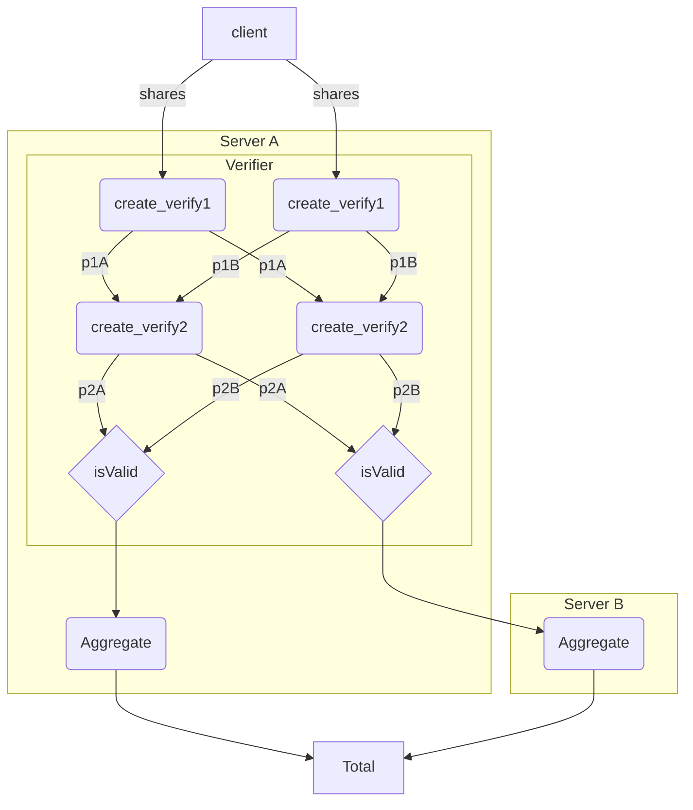

# A scheduler for coordinating aggregation

The Prio system consists of independently operated servers that participate in a
privacy preserving aggregation scheme. In this document, we consider two servers
coordinating using a message passing schema with a security boundary backed by a
remote filesystem. This design separates data storage and access from
computation and simplifies the overall coordination process.

The key assumption is that data processing happens in large batches. We ignore
issues like dropped or late packets and instead aggregate over the shared set of
corresponding documents.

## A directed, acyclic graph

The data flow can be described as a directed, acyclic graph (DAG). Each of the
serialized data packets act as dependencies that are used in the next step.

There are four server-side steps over two entities that we must consider.

* `verify1`
* `verify2`
* `aggregate`
* `publish`

We can describe this in a data modeling language to generate a flow chart.



### Separation of data storage and data processing

Each step in the flow chart is separated into two parts. There is the actual
computation that is performed for each packet which involves loading data into
memory, running the computation, and then exporting the data to disk. Then there
is the step of moving data from server to the other for the rest of the process
to continue.

This flow can be implemented at the process boundary using the file-system on a
single server, as demonstrated by the command-line interface. We may translate
this to multiple servers by isolating each process to a servers in a network, so
that memory is physically isolated.

### A concrete implementation

Here, we use the following components to build out a concrete implementation of
the Prio system that delivers on the privacy guarantees given proper operational
deployment.

An s3-compatible file-store is used as the storage component. We rely on the
security mechanisms of the the file-store to ensure that each server has access
to the proper content. Docker containers running the CLI tool are the unit of
computation. A host mounts a directory and all the required environment
variables into the the container to obtain the corresponding outputs. Finally,
the host acts as a scheduling system -- it contains all of the configuration
including polling intervals, data locations, operational keys, etc.

* minio - the s3 compatible file-store
* docker - used to build the containers for portable computation
* airflow - the scheduling service for DAG construction and general scripting

#### Airflow DAGs

Airflow is platform to programmatically author, schedule, and monitor workflows.
It provides high-level primitives which we can use for constructing and
implementing a DAG of computation.

We define three operators:

* FileSensor - A generic sensor that polls for data in a particular bucket at a
  regular interval.
* PrioOperator - An operator that executes a step of the Prio CLI inside of a
  docker container.
* MoveOperator - An operator that moves data from the internal network to the
  external network of the co-processor.

We re-use the same file-system paths in the CLI document for consistency.

```python 
paths = [
    "raw",
    "intermediate/internal/verify1",
    "intermediate/internal/verify2",
    "intermediate/internal/aggregates",
    "intermediate/external/verify1",
    "intermediate/external/verify2",
    "intermediate/external/aggregates",
    "proccessed"
]
```

As a representative example, we will use the second step of the aggregation
pipeline, `verify2`. As a refresher, this step verifies that the secret-shared
non-interactive proof given by the client is well-formed. The help page for
`prio verify2` is repeated here for reference.

````bash
Usage: prio verify2 [OPTIONS]

  Verify a batch of SNIPs

Options:
  --n-data INTEGER                The size of the input bit-vector.
                                  [required]
  --batch-id BYTE-STRING          A shared batch identifier used as a validity
                                  check.  [required]
  --shared-secret BYTE-STRING     The shared server secret encoded in base64.
                                  [required]
  --private-key BYTE-STRING       The private key of the processing server.
                                  [required]
  --server-id [A|B]               The identifier for match.  [required]
  --public-key-external BYTE-STRING
                                  The public key of the co-processing server.
                                  [required]
  --public-key-internal BYTE-STRING
                                  The public key of the processing server.
                                  [required]
  --input FILE                    File containing shares from clients.
                                  [required]
  --input-external FILE           File containing data generated by the co-
                                  processing server.  [required]
  --input-internal FILE           File containing data generated by the
                                  processing server.  [required]
  --output DIRECTORY              The path to the output directory.
                                  [required]
  --help                          Show this message and exit.
````

First, we define a node that polls a prefix where incoming data may appear. The
term `external` is relative to the current server.

```python
file_sensor = FileSensor(
    protocol="s3a",
    bucket="server-a",
    prefix="intermediate/external/verify2/",
)
```

Next, we define the actual job. For simplification, we assume the connection
string contains the server specific configuration for this particular job,
including the size of the input vector, the batch id, the shared sever secret,
and keys.

```python
prio_operator = PrioOperator(
    image="mozilla/prio:latest",
    command="prio verify2",
    conn_id="prio_default",
    arguments={
        "input": "raw",
        "input-internal": "intermediate/internal/verify1"
        "input-external": "intermediate/external/verify1",
        "output": "intermediate/internal/verify2"
    }
)
```

To finish up the step, we copy the data to the appropriate location in the
co-processors bucket.

```python
move_operator = MoveOperator(
    protocol="s3a",
    internal_bucket="server_a",
    internal_prefix="intermediate/internal/verify2",
    external_bucket="server_b",
    external_prefix="intermediate/external/verify2",
)
```

The individual nodes can be chained together.

```python
file_sensor >> prio_operator >> move_operator
```
