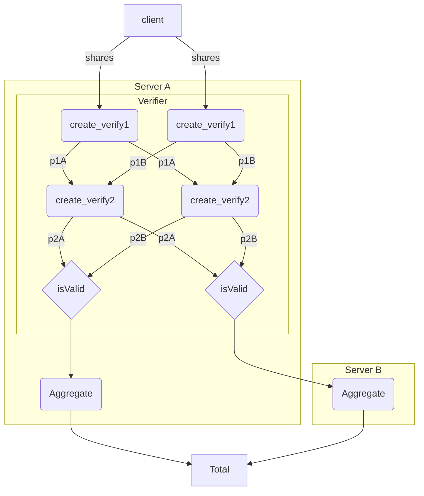

# asyncio Example Usage

This example demonstrates usage of the python wrapper using asyncio. 

## Running the example

```bash
docker run -v $(pwd):/app -it prio:dev python3 main.py
```

Results in:

```bash
INFO:root:Starting asyncio prio pipeline.
INFO:root:Client 0: Generate shares
INFO:root:Client 1: Generate shares
INFO:root:Client 2: Generate shares
INFO:root:Client 3: Generate shares
INFO:root:Server 1, PID 0: Generate verify packet 1
INFO:root:Server 0, PID 0: Generate verify packet 1
INFO:root:Server 0, PID 1: Generate verify packet 1
INFO:root:Server 0, PID 2: Generate verify packet 1
INFO:root:Server 1, PID 1: Generate verify packet 1
INFO:root:Server 0, PID 3: Generate verify packet 1
INFO:root:Server 0, PID 0: Generate verify packet 2
INFO:root:Server 1, PID 2: Generate verify packet 1
INFO:root:Server 0, PID 1: Generate verify packet 2
INFO:root:Server 0, PID 2: Generate verify packet 2
INFO:root:Server 1, PID 3: Generate verify packet 1
INFO:root:Server 0, PID 3: Generate verify packet 2
INFO:root:Server 1, PID 0: Generate verify packet 2
INFO:root:Server 0, PID 0: Aggregate data
INFO:root:Server 1, PID 1: Generate verify packet 2
INFO:root:Server 0, PID 1: Aggregate data
INFO:root:Server 1, PID 2: Generate verify packet 2
INFO:root:Server 0, PID 2: Aggregate data
INFO:root:Server 1, PID 3: Generate verify packet 2
INFO:root:Server 0, PID 3: Aggregate data
INFO:root:Server 1, PID 0: Aggregate data
INFO:root:Server 1, PID 1: Aggregate data
INFO:root:Server 1, PID 2: Aggregate data
INFO:root:Server 1, PID 3: Aggregate data
INFO:root:Done!
```

## Dataflow diagram



