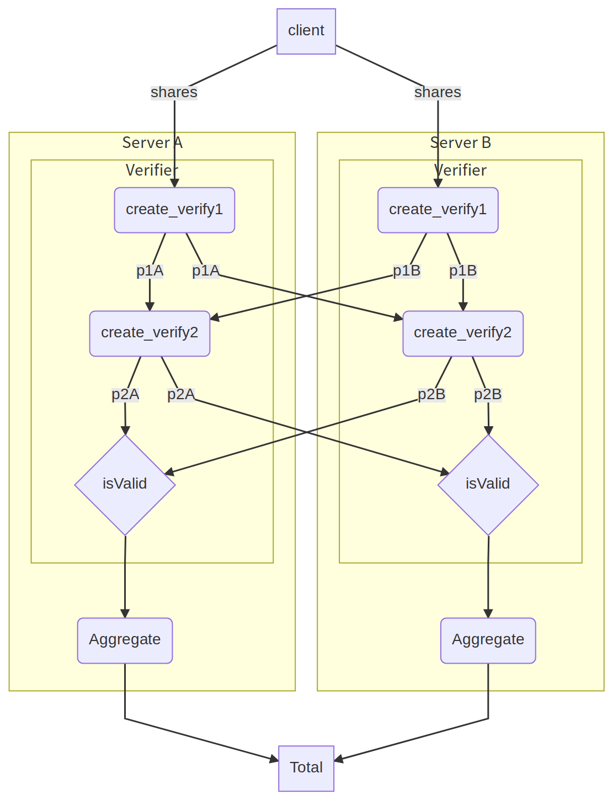

# asyncio Example Usage

This example demonstrates usage of the python wrapper using asyncio. 

## Running the example

```
$ pipenv sync
$ pipenv run main.py
```

## Dataflow diagram




```
graph TD

client -->|shares| create_p1A(create_verify1)
subgraph Server A
    subgraph Verifier
        create_p1A --> |p1A| create_p2A(create_verify2)
        create_p2A --> |p2A| isvalid_A{isValid}
    end
    isvalid_A --> aggregate_A(Aggregate)
end 

create_p1A --> |p1A| create_p2B
create_p2A --> |p2A| isvalid_B


client -->|shares| create_p1B(create_verify1)
subgraph Server B
    subgraph Verifier
        create_p1B --> |p1B| create_p2B(create_verify2)
        create_p2B --> |p2B| isvalid_B{isValid}
    end
    isvalid_B --> aggregate_B(Aggregate)
end 

create_p1B --> |p1B| create_p2A
create_p2B --> |p2B| isvalid_A


aggregate_A --> Total
aggregate_B --> Total
```